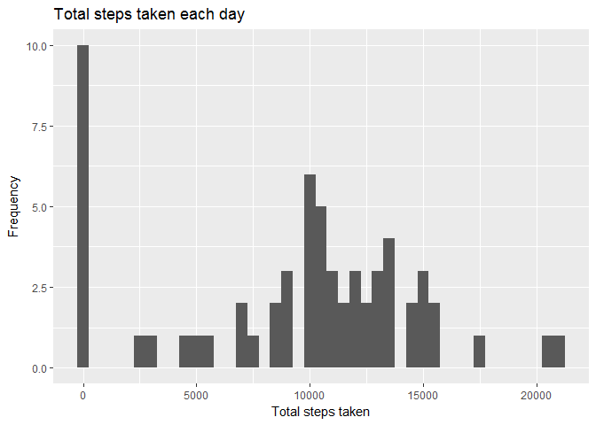
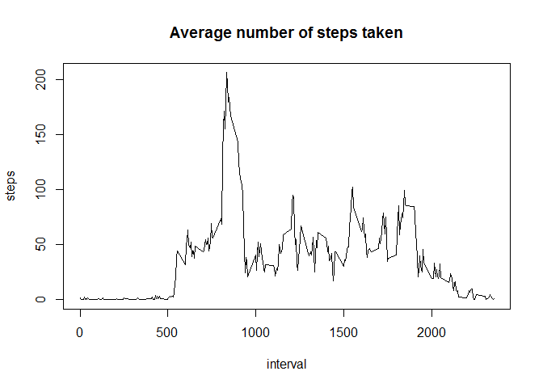
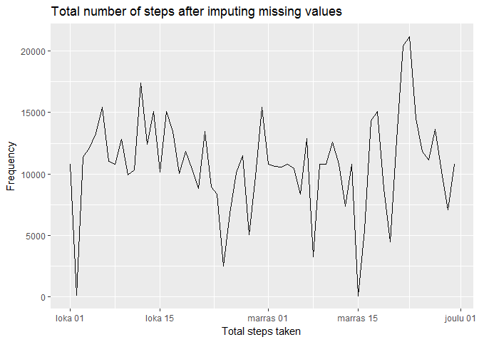
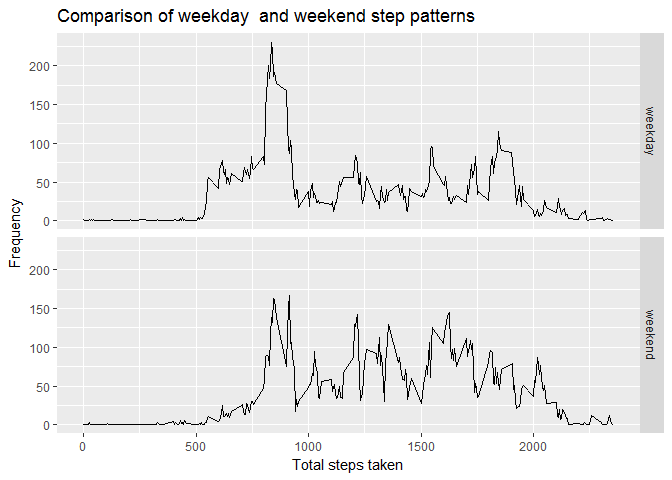

## Introduction
The codes below take as input data from a personal activity monitoring device that collects data at 5 minute intervals through out the day. Using that data, scripts below explore the dataset and get answers for some questions posed in the Reproducible research course project.

## First load the necessary libraries.


```r
library(ggplot2)
library(knitr)
library(dplyr)
library(rmarkdown)

opts_chunk$set(echo = TRUE, results = "hold", tidy = TRUE)
```
Remember to also set your working directory.

## Fist unzip the activity file provided


## Load and preprocess the data
1. Load the data

```r
data <- read.csv("ActivityData/activity.csv", header = TRUE, sep = ",", na.strings = "NA", 
    stringsAsFactors = FALSE)
```

This creates a data frame with 17,568 observations and 3 variables (i.e., steps (int), date (chr), and interval (int)).

2. Process / transform the data into a suitable format

```r
data$date <- as.Date(as.character(data$date), format = "%Y-%m-%d")
```
Here we change the date variable type to Date rather than have it as character.


## What is mean total number of steps taken per day?
1. Fist calculate the total number of steps taken per day

```r
total_steps <- with(data, tapply(steps, date, sum, na.rm = TRUE))
```


2. Then we plot with Histogram, the total number of steps taken each day

```r
qplot(total_steps, xlab = "Total steps taken", ylab = "Frequency", main = "Total steps taken each day", 
    binwidth = 500)
```

<!-- -->


3. Get the mean and median of the total number of steps taken per day

```r
mean_steps <- mean(total_steps, na.rm = TRUE)
median_steps <- median(total_steps, na.rm = TRUE)
```

We find that the mean steps = 9,354.23, and that the median = 10,395


## What is the average daily activity pattern?
1. time series of 5-minute interval (x-axis) and the average number of steps taken, averaged across all days (y-axis)

First we get the time-serie data

```r
ts <- aggregate(steps ~ interval, data = data, mean, na.rm = TRUE)
```

Then plot the time-series

```r
plot(ts, type = "l")
xlab("5-minute interval")
ylab("average number of steps taken")
title("Average number of steps taken")
```

<!-- -->


2. which 5-minute interval, on average across all the days in the dataset, contains the maximum number of steps?

```r
max_index <- which.max(ts$steps)
interval_step <- ts[max_index, ][1]
```

From the above we find that the 835 interval is the maximum amount of steps.

## Imputing missing values
1. Calculate and report the total number of missing values in the dataset 

```r
total_missing <- sum(is.na(data))
```
Here we see that the total number of missing values = 2,304


```r
mean(is.na(data$steps))
```
We also find that missing values constitute small pecentage of the data, ~13%.

2. Devise a strategy for filling in all of the missing values in the dataset.

From the plot it seems, that the missing data is at the beginning, which might mean that the person forgot to switch it on. 


3. I first impute the missing values on the data frame and assign it to a new data frame

```r
na_fill <- function(df, pervalue) {
    na_index <- which(is.na(df$steps))
    na_replace <- unlist(lapply(na_index, FUN = function(idx) {
        interval = df[idx, ]$interval
        pervalue[pervalue$interval == interval, ]$steps
    }))
    fill_steps <- df$steps
    fill_steps[na_index] <- na_replace
    fill_steps
}

data2 <- data.frame(steps = na_fill(data, ts), date = data$date, interval = data$interval)
```


4.a. Make a histogram of the total number of steps taken each day

```r
total_steps2 <- aggregate(steps ~ date, data = data2, sum)
```

```r
ggplot(total_steps2, aes(x = date, y = steps)) + geom_line() + labs(x = "Total steps taken", 
    y = "Frequency", title = "Total number of steps after imputing missing values")
```

<!-- -->


4.b.  Calculate and report the mean and median total number of steps taken per day. 

```r
mean_steps2 <- mean(total_steps2$steps, na.rm = TRUE)
median_steps2 <- median(total_steps2$steps, na.rm = TRUE)
```

We can see that the mean and median values differ now that the NAs are removed. Both values are now equal to 10,766.19.

## Are there differences in activity patterns between weekdays and weekends?
1. Create a new factor variable in the dataset with two levels - "weekday" and "weekend" indicating whether a given date is a weekday or weekend day.

```r
data2$date <- ifelse(as.POSIXlt(data2$date)$wday %in% c(0, 6), "weekend", "weekday")
```


2. A panel plot containing a time series plot of the 5-minute interval (x-axis) and the average number of steps taken, averaged across all weekday days or weekend days (y-axis). 

```r
total_steps3 <- aggregate(steps ~ interval + date, data = data2, mean)
ggplot(total_steps3, aes(interval, steps)) + geom_line() + facet_grid(date ~ 
    .) + labs(x = "Total steps taken", y = "Frequency", title = "Comparison of weekday  and weekend step patterns")
```

<!-- -->

